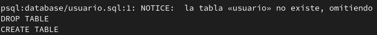
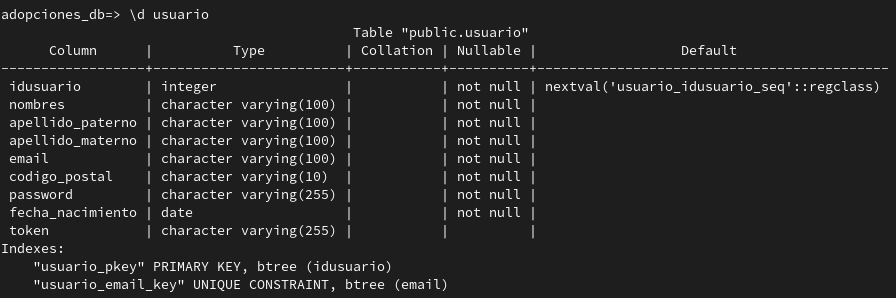
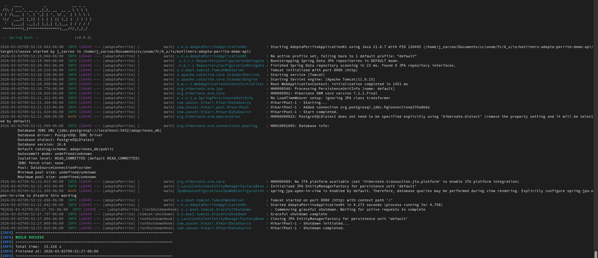

# Práctica 2
Kotliners

## Pasos para el levantamiento del proyecto

1. Verifica que PostgreSQL esté activo
```sh
systemctl status postgresql
```
2. Entra a Postgres `sudo -u postgres psql` y crea la base de datos en PostgreSQL con el script
```sh
CREATE USER <USER_DB> WITH PASSWORD '<PASSWORD_DB>';
CREATE DATABASE adopciones_db OWNER <USER_DB>;
\q
```
3. Agrega la tabla Usuario a la base de datos con el script [usuario.sql](database/usuario.sql)
```sh
psql -U <USER_DB> -d adopciones_db -f database/usuario.sql
```



Verificamos su creación con 

```sh
psql -U <USER_DB> -d adopciones_db
\dt
\d usuario
\q
```


4. Asegurate de completar tus variables de entorno en tu archivo `.env`, tomando como guía el archivo `.env.example`

5. Verificar conexión sin errores al levantar el proyecto

```sh
mvn spring-boot:run
```


Verificamos que Hikari logró entrar a PostgreSQL con las credenciales proporcionadas